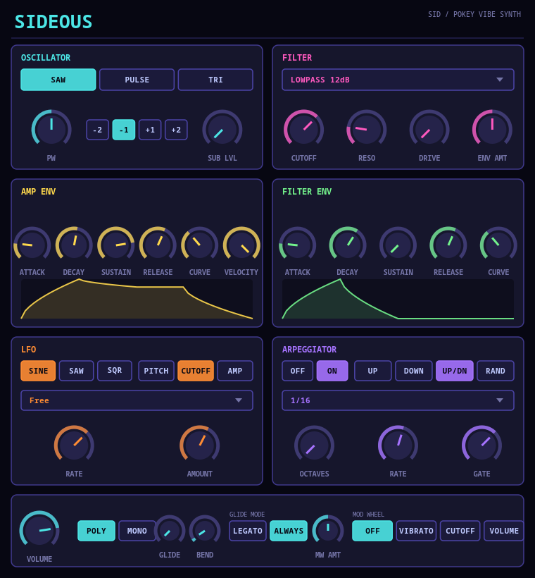

# Sideous


> **⚠️ VIBE CODED SLOP.** This entire plugin — DSP, GUI, CI — was built through
> conversational back-and-forth with an AI, not hand-engineered from a spec.
> It works, it's been tested, but go in with appropriate expectations.

A SID/POKEY-flavored chiptune synth plugin (VST3 / LV2 / CLAP / JACK
standalone), built on [DPF](https://github.com/DISTRHO/DPF) with a hand-drawn
Cairo-based retro UI. No built-in delay/reverb on purpose — plug it into
whatever effects you already use.



## Features

- **Oscillator**: saw / pulse (variable pulse width) / triangle, plus a
  sub-oscillator (±1/±2 octaves, adjustable level)
- **Filter**: switchable lowpass/highpass, 12dB and 24dB slopes, plus a
  simplified Moog-style ladder filter, with resonance and drive
- **Dual ADSR**: separate envelopes for amp and filter cutoff, each with a
  shapeable curve and a live curve-graph visualization; filter envelope
  amount can sweep the entire cutoff range end to end
- **LFO**: sine/saw/square, free-running or tempo-synced (1/1 down to 1/64
  including dotted/triplet divisions), routable to pitch, cutoff, or volume —
  handy for pseudo-arpeggios
- **Arpeggiator**: Up / Down / Up-Down / Random patterns, 1–4 octaves,
  tempo-synced rate, adjustable gate length
- **Voice modes**: 16-voice polyphony, or mono with portamento (glide time,
  and a Legato/Always mode to control when it kicks in)
- **Performance controls**: velocity sensitivity, pitch bend (configurable
  range), mod wheel (routable to vibrato / cutoff / volume, with adjustable
  depth)
- Knobs show live values while being automated, not just while dragging

## Building

```sh
git clone --recursive <repo-url>
cd sideous
cmake -S . -B build
cmake --build build -j$(nproc)
```

(If you already cloned without `--recursive`, run
`git submodule update --init --recursive` first.)

Built plugins land in `build/bin/` — `sideous.vst3`, `sideous.lv2`,
`sideous.clap`, and a JACK/native-audio standalone (`sideous`).

CI ([`.github/workflows/build.yml`](.github/workflows/build.yml)) builds
Linux and Windows packages on every push and attaches them to GitHub Releases
for tagged versions.
